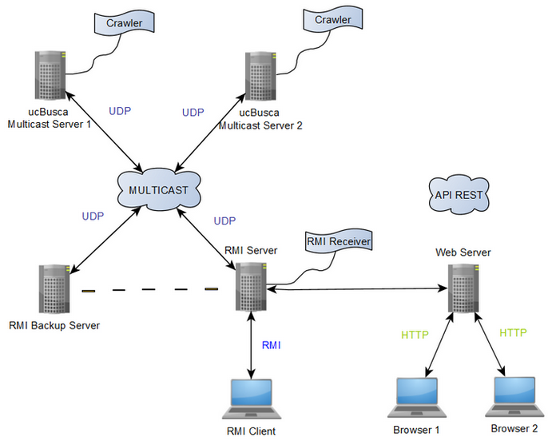
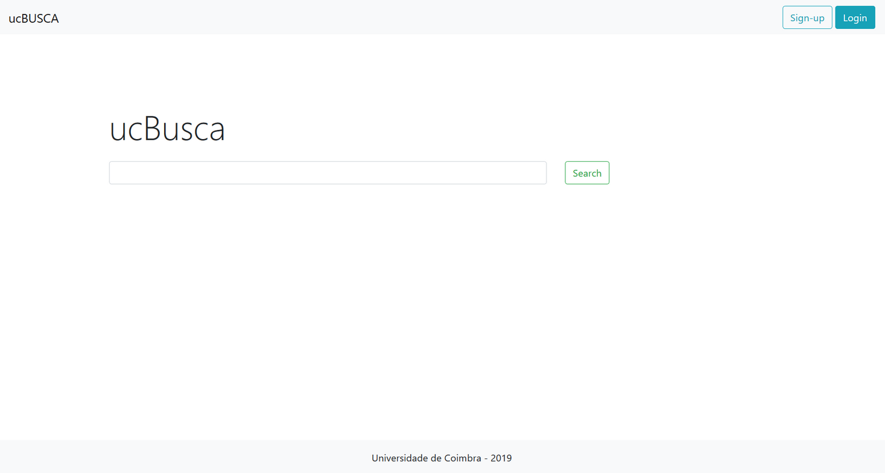
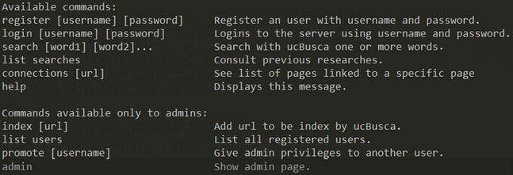

# ucBusca-web-crawler
Web interface based on a Client-Server architecture implementing search and automatic indexing of web pages (web crawler). Communication carried out through UDP, Multicast sockets and WebSockets (asynchronous) and data access through a Java RMI layer. Jsoup was used to extract information from web pages. Yandex REST API integrated for language translation. 
The frontend web interface implementation is based on a MVC model (model-view-controller). It was built using Apache Struts 2 framework, JavaServer Pages (JSP) for dynamic web page generation and serializable java objects JavaBeans. Apache Tomcat was used as a Java web server. 

## Table of Contents
- [Project Structure](#project-structure)
- [Getting Started](#getting-started)
    - [Prerequisites](#prerequisites)
    - [Installation](#installation)
    - [Build and Run](#build-and-run)
- [Software Architecture](#software-architecture)
- [Features](#features)
- [Usage](#usage)
- [Contact](#contact)
---

## Project Structure
```
├───.settings               
├───build                   
│   └───classes             
│       ├───RMIClient       
│       ├───RMIServer       
│       ├───shared          
│       ├───ucbusca         
│       │   ├───action      
│       │   ├───api         
│       │   ├───model       
│       │   └───websocket   
│       └───UcBuscaMServer  
├───jars
├───wars                  
├───lib                     
├───src                     
│   ├───RMIClient           
│   ├───RMIServer           
│   ├───shared              
│   ├───ucbusca             
│   │   ├───action          
│   │   ├───api             
│   │   ├───model           
│   │   └───websocket       
│   └───UcBuscaMServer      
└───WebContent              
    ├───META-INF
    └───WEB-INF
        └───lib 
```


## Getting Started
All subsequent instructions assume the use of Eclipse IDE for JavaEE developers. The software is accessible for download at https://www.eclipse.org/downloads/packages/.

### Prerequisites
- Java Development Kit (JDK) - https://www.oracle.com/java/technologies/javase-downloads.html
- Apache Tomcat - https://tomcat.apache.org/
- Struts2 framework version 2.3.16.3 - https://archive.apache.org/dist/struts/binaries/
- [JavaServer Pages TagLib Implementation 1.2.1](https://mvnrepository.com/artifact/org.glassfish.web/javax.servlet.jsp.jstl/1.2.1) and [JavaServer Pages Library API 1.2.1](https://mvnrepository.com/artifact/javax.servlet.jsp.jstl/javax.servlet.jsp.jstl-api/1.2.1) (.jar)
- Jsoup library (.jar) - https://jsoup.org/download
- JSON-Java package (.jar) - [package org.json](https://repo1.maven.org/maven2/org/json/json/20200518/json-20200518.jar)
- In case you want to use the translation functionality you will need a Yandex API Key - [Get API Yandex KEY](https://translate.yandex.com/developers/keys)

### Installation
- Create a Dynamic web project on Eclipse
- Copy all files into the created project
- Add ``Jsoup`` and ``JSON`` downloaded jars to the lib folder
- Add ``Struts 2`` downloaded libraries to WebContent/WEB-INF/lib folder
- In case you opted to use Yandex, insert your ``Yandex API key`` on line 17 of YandexClient.java file (src/ucbusca/api/YandexClient.java). Otherwise comment the lines indicated on the files src/ucbusca/model/SearchBean.java and WebContent/results.jsp .


On Eclipse make sure that all libraries are correctly added on the Java build path. You can access your build path on eclipse through *Project -> Properties -> Java Build Path -> Libraries*.

Also ensure that your version of ``Apache Tomcat`` is included on the Runtime Environment by navigating to *Window -> Preferences -> Server -> Runtime Environments*. 

### Build and Run
Run the programs: `RMIServer.java`,` UcBuscaMServer.java` and `RMIClient.java` as java application.

Run the index.jsp on the web server.

Access the browser: ``localhost/8080/ucBusca``

The address and port parameters can be changed in the arguments of the RMIServer, UcBuscaMServer and RMIClient files (*Right click on the file -> Properties -> Run/Debug Settings -> Edit -> Arguments*).

<br>

**Arguments**

UcBuscaMServer: MULTICAST_ADDRESS, PORT (Example: ``224.1.2.3 5000``)

RMIServer: MULTICAST_ADDRESS PORT RMI_ADDRESS RMI_PORT (Example: ``224.1.2.3 5000 localhost 7000``)

RMIClient: RMI_ADDRESS RMI_PORT (Example: ``localhost 7000``)

<br>

Use eclipse to compile the project for ``.war`` and ``.jar``.
To run ``.war`` you must place the ``.war`` file created in the *webapps* directory of Apache Tomcat.
You must run the following command inside the Apache Tomcat bin directory to start the server:

```
\bin\startup.bat
```

To run the `.jar` you must use the command:

```
java -jar filename.jar argument_1 argument_2 argument_n
```

You can then access the browser: ``localhost/8080/<filename>``


## Software Architecture



The Multicast and RMI servers follow a ``multithread`` model architecture. 
The communication between the Multicast server and the RMI server is enabled through a ``Multicast socket``. ``JAVA RMI`` is used for communication between the RMI server and Client instances. 

**Multicast Servers**

Central replicated servers that store all data application, supporting all necessary operations through requests received in multicast datagrams. Send responses via multicast communication (one-to-many) using a ``UDP protocol`` previously defined. Contains the Web Crawler (Multicast server Thread) responsible for recursive url indexing. 

**RMI Servers**

The Primary RMI Server provide, through its remote interface, a set of methods accessible to Java RMI applications. When a method is invoked, the service RMI translator translates this request into a UDP datagram sent by multicast to the Multicast servers, and then wait for the response sent by multicast. Receives all messages sent on the Multicast Network (RMIReceiver Thread) so that they are available to access, selection and aggregation. Doesn't store data locally. 

**RMI Client**

Command line interface used by users to access the application functionalities. Invokes the remote methods on the RMI server.

**Web Server**

The web application runs on an HTTP server (Apache Tomcat) and that acts as a client of the RMI server. Users can use Web browsers to connect to the web server and request pages using the ``HTTP protocol``.


## Features

**Functional**

- User Registration and Login
    - Access to application protected with username and password

- Recursive url indexing (web crawler)
    - Whenever a Url is indexed, each word that is found in the web page is added to an inverted index together with the url (added to the list of each word found). Thus, the inverted index saves for each word the pages on which it occurs. The links found on the page are placed on a list of urls to visit, to be indexed recursively by the crawler. Each link found is also added to another inverted index that saves, for each of them, the original pages on which they were discovered. Recursive indexing is done to a certain depth level, which can be defined.

- Load balancing between Multicast servers
    - Each URL is independently indexed by a single Multicast server. After a index request, the url is sent to the multicast server having the less load to process. Additionally, when recursively indexing a Url, each multicast server forward some of the links found to other multicast servers, in order to distribute work and improve performance. The multicast servers receiving the shared request can reject it if their load is superior to the server making the request. 

- Search engine
    - Display the list of pages that contain the search terms by querying the inverted index. The search results are ordered by number of links for each page.

- Retrieve list of pages connected/linked to a specific page
    - Display the list of pages by querying the inverted index.

- Give an user administrator privileges
- Retrieve list of users registered and user research history
- Aggregation of different results coming from multiple Multicast servers (search and list requests)
- Thread and shared data synchronization


**WebSockets**
- Immediate and/or upon login notification of administrator privileges (online and offline users respectively)
    - Development of a WebSocket that allows the interaction between the Web browser (client) and the Web Server for asynchronous communication, facilitating the real-time transfer of information in the absence of a request from the client. ``RMI callback`` was used for remote invocation of methods in WebSocket by the RMI Server.

**REST**
- Each search result shows the original language of the page
- Page title and description are translated into Portuguese


**Exception Handling**

- Temporary malfunctions of multicast servers and failure of an RMI server has no visible effect on clients
- Secondary RMI server tests (through RMI call) and replaces the primary in the event of a long malfunction
- In the event of a long breakdown, RMI clients call the secondary (maintained session)
- Indexing requests are answered only by a multicast server
- The system accepts any number of RMI customers

**Failover**

- The system is guaranteed to function as long as one Multicast server is active (the others may malfunction or be disconnected) 
- Each server distributes URLs to be indexed by other servers (parallel construction of inverted index)
- The original RMI server, when recovered, becomes secondary


## Usage



When a user accesses the Web interface a general search screen appears. The search functionality is available to any user. When performing a search, a user is redirected to another page and obtains a list of the ten more relevant pages containing the searched words and the approximate number of search results. For each search result, the page title, URL, quote text and original language in which the page was written are displayed. The results are always presented in Portuguese.

If a user is registered and logged into the application, he can access his user page. From there he can see his personal research history. He can also retrieve the list of pages linked to a specific url. Users with administrator privileges can introduce URLs to be indexed by the system, request the list of users registered and give another user administrator privileges.


On the RMI Client command line interface, the user can write the ``help`` command on the console. All available options are printed right away.




## Contact
Created by [@filipamartins](https://github.com/filipamartins) - feel free to contact me through filipa.af.martins@gmail.com.